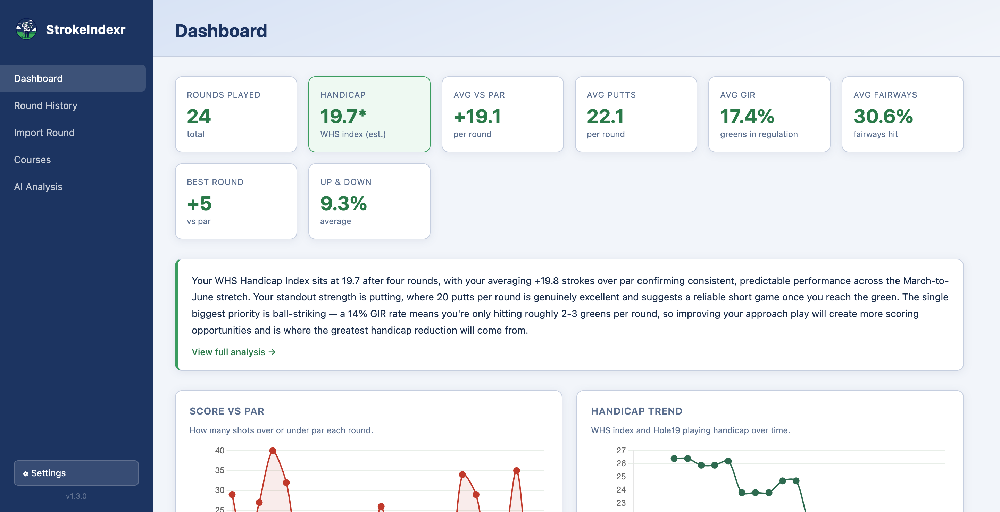
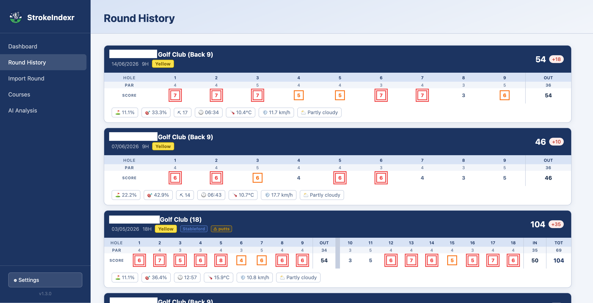
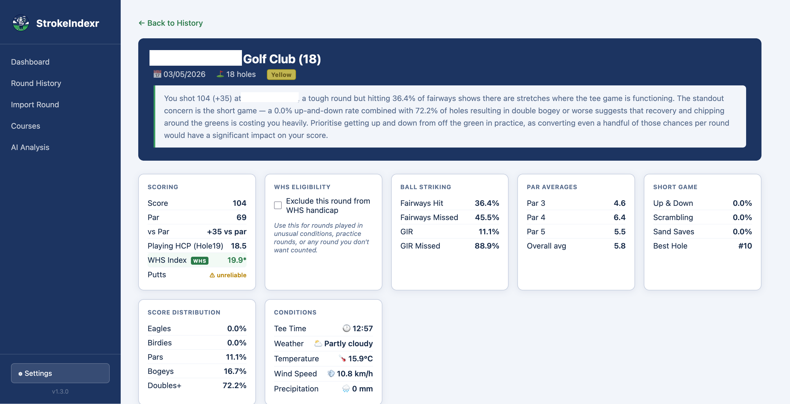
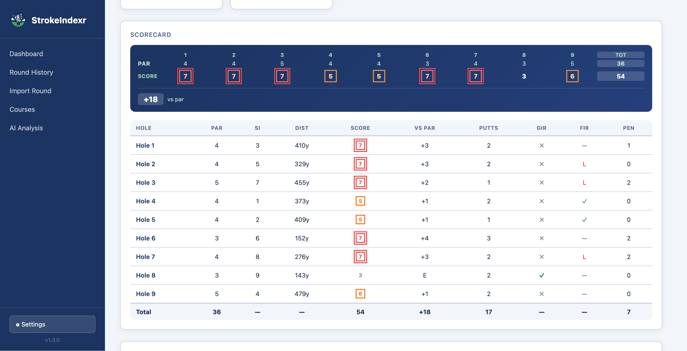
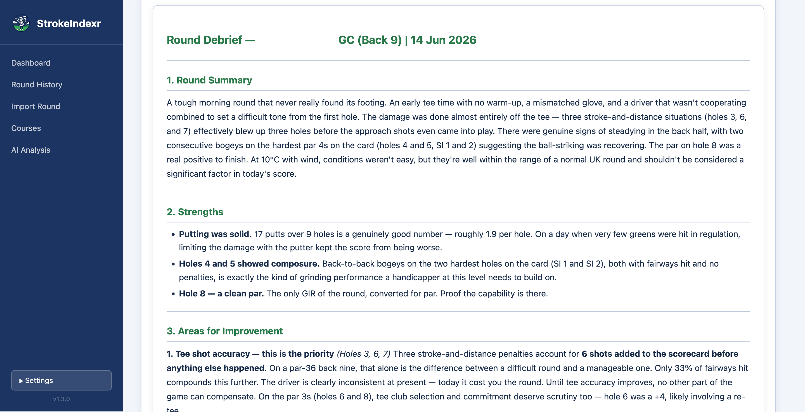

<div align="center">
  

  # StrokeIndexr

  **Your golf game, finally making sense.**

  *A personal golf statistics tracker that runs entirely on your own computer.*
</div>

## Screenshots

<!-- Screenshot tour — drop PNG files into docs/screenshots/ using the filenames below -->

| Dashboard | Round history |
|-----------|---------------|
|  |  |

| Round detail | Scorecard |
|--------------|-----------|
|  |  |

| AI round debrief |
|-----------------|
|  |

---

> **Disclaimer:** StrokeIndexr is an independent, unofficial project and is not affiliated with, endorsed by, or connected to Hole19 Golf or any other third party. When you import a round, the app fetches weather data from Open-Meteo's free public API using the course GPS coordinates — no account or API key is required, and no personal data is sent. All round data is imported by you from your own personal round history, and remains stored entirely on your own machine.

---

## Features

- **Import rounds from Hole19** — paste a round URL and your full scorecard imports automatically, including every hole, with stats pre-calculated.
- **Email import** — alternatively, paste the Hole19 round summary email directly into the app to import without a URL.
- **Per-hole scorecard view** — TV broadcast-style scoring notation (circles for birdies, squares for bogeys) so you can see at a glance how a round went. Pickup holes are shown with a bullet marker.
- **Weather data** — temperature, wind speed, precipitation and conditions are automatically fetched for each round using the course location and tee time, and displayed on your round history and round detail views.
- **Handicap index** — calculated using the World Handicap System (WHS) formula from your last 20 rounds, including 9-hole round pairing and manual exclusions. This is an unofficial estimate for personal tracking purposes only and is not a recognised WHS handicap.
- **Course tracker** — stats per course, front/back 9 grouping, and per-tee course rating and slope for accurate handicap calculations.
- **Tee colour tracking** — records which tees you played (white, yellow, red, blue) and factors this into your WHS differential.
- **AI coaching summaries** — connect your own AI API key (Claude, ChatGPT, Gemini, and others supported) to get a performance review and practice plan based on your recent rounds. Analysis is location-aware, accounts for weather conditions, playing frequency, rustiness after long gaps, your player profile, and your full handicap trajectory.
- **Round debrief** — generate a detailed AI analysis of any individual round, including a hole-by-hole breakdown covering putts, penalties, bunker shots, GIR and fairways.
- **Player profile** — record your age, golf background, practice habits and self-assessed strengths and weaknesses so the AI coach can tailor its advice to you. Your club distances are calculated automatically from your tracked shots. Sharing your profile with the AI is entirely optional and controlled by a single privacy toggle.
- **Date-windowed analysis** — AI summaries cover a 90-day window by default, regenerating only when new rounds are added so you do not waste API credits.
- **Round notes** — add your own context to any round (how you felt, conditions, distractions). Notes can optionally be included in AI analysis to give the coach richer context, with full privacy controls to opt out per round or globally.
- **Dashboard** — score trends, GIR, putts per round, and a live handicap trend chart.
- **Fully private** — everything runs locally on your computer. Your data never leaves your machine, except for the optional AI requests you choose to make.

---

## What you'll need

- A Mac, Windows PC, or Linux machine.
- Python 3.10 or later (see install steps below).
- A [Hole19](https://hole19golf.com) account with some rounds tracked.
- *(Optional)* An API key from an AI provider if you want coaching summaries.

---

## Getting started

### 1. Install Python *(first time only)*

StrokeIndexr needs Python 3.10 or later. If you are not sure whether you have it, the start script will tell you.

**Mac:**

The easiest option is [Homebrew](https://brew.sh) — if you use it for other tools, this is one command:
```bash
brew install python
```
Otherwise, download the installer from [python.org/downloads](https://www.python.org/downloads/), run it, and follow the prompts — no custom settings needed.

**Windows:**

If you have [winget](https://learn.microsoft.com/en-us/windows/package-manager/winget/) (built into Windows 10/11), open a terminal and run:
```
winget install Python.Python.3.13
```
This handles the PATH automatically — no extra steps needed.

Alternatively, download the installer from [python.org/downloads](https://www.python.org/downloads/) and run it. **Important:** tick **"Add Python to PATH"** on the first screen before clicking Install — without this the start script will not be able to find Python.

**Linux:**

Use your distro's package manager:
```bash
# Ubuntu/Debian
sudo apt install python3 python3-pip python3-venv

# Fedora
sudo dnf install python3

# Arch
sudo pacman -S python
```
If you use [Homebrew on Linux](https://brew.sh), `brew install python` also works.

### 2. Download StrokeIndexr

Click the green **Code** button → **Download ZIP**, then unzip it somewhere on your computer.

### 3. Start the app

**Mac:**
1. Double-click **`Start - Mac.command`**.
2. If macOS blocks it, go to **System Settings → Privacy & Security** and click **Open Anyway**.

**Windows:**
1. Double-click **`Start - Windows.bat`**.

**Linux:**
```bash
bash "Start - Linux.sh"
```

The first run will install all required Python packages automatically. This may take a minute or two — you only need to wait once.

If Python is not installed or is too old, the start script will tell you exactly what to do.

### 4. Open the app

Your browser should open automatically to **http://127.0.0.1:5050**.

If it does not, open your browser and go to that address manually.

---

## Importing your first round

1. Open a round on [hole19golf.com](https://www.hole19golf.com) — you will find your rounds under **Performance → Rounds**.
2. Copy the URL (it will look like `https://www.hole19golf.com/performance/rounds/XXXXXX`).
3. In StrokeIndexr, go to **Import Round**, paste the URL, and click **Import**.
4. You will be asked which tees you played — pick the right colour and you are done.

Alternatively, if you have the Hole19 round summary email, you can paste it directly using the **Import from email** option on the same page.

---

## Setting up AI summaries *(optional)*

StrokeIndexr works great without AI, but if you would like coaching summaries:

1. Click **⚙ Settings** in the bottom-left of the sidebar.
2. Under **AI**, choose your preferred provider and paste in your API key.
3. Head to the **AI Analysis** tab and click **Generate Analysis**.

Supported providers: Claude (Anthropic), ChatGPT (OpenAI), Gemini (Google), Groq, Mistral, OpenRouter, Ollama (local), LM Studio (local).

### Getting a free API key with OpenRouter

[OpenRouter](https://openrouter.ai) is the easiest way to get started for free — it gives you access to a range of AI models through a single API key, including several with no cost.

1. Go to [openrouter.ai](https://openrouter.ai) and create a free account.
2. Go to **Keys** and click **Create Key** — copy the key it generates.
3. In StrokeIndexr settings, set the provider to **OpenRouter** and paste your key.
4. Leave the model field blank to use the default, or enter a free model name such as `mistralai/mistral-7b-instruct` or `meta-llama/llama-3-8b-instruct`.

You can browse all available models and their pricing at [openrouter.ai/models](https://openrouter.ai/models) — filter by "Free" to see options that cost nothing.

> **Note:** Free models on OpenRouter are capable but less powerful than paid options like Claude or GPT-4. For most golf analysis use cases they work well.

### Notes and privacy

Round notes you add can optionally be included in AI analysis to give the coach richer context — for example, if you felt fatigued, skipped a warm-up, or played in unusual circumstances. The AI is instructed to use notes for performance context only and will never reference personal names or identifying details.

You can control this behaviour in two ways:

- **Globally** — go to **Settings → Privacy** to set your default for all new rounds.
- **Per round** — use the "Exclude from AI analysis" checkbox in the notes section of any round.

---

## Updating StrokeIndexr

When a new version is available, a small notification will appear in the bottom-left of the sidebar. Your data is stored separately from the app and is never affected by an update.

### If you downloaded a ZIP

1. Download the latest ZIP from the [Releases page](https://github.com/f0dders/strokeindexr/releases/latest).
2. Unzip it anywhere and start the app — your data carries over automatically.

### If you cloned the repo with Git

Double-click the appropriate update script:
- **Mac:** `Update - Mac.command`
- **Windows:** `Update - Windows.bat`
- **Linux:** `bash "Update - Linux.sh"`

Then restart the app.

---

## Stopping the app

Close the terminal window (Mac/Linux) or command prompt window (Windows) that opened when you started the app.

---

## Your data

Your round data is stored in a standard location on your computer, separate from the app folder. This means updating the app will never touch your data.

| Platform | Location |
|----------|----------|
| Mac | `~/Library/Application Support/strokeindexr/` |
| Windows | `%APPDATA%\strokeindexr\` |
| Linux | `~/.local/share/strokeindexr/` |

Back up the `golf.db` file in that folder if you want to keep it safe. You can also copy it to another machine to transfer your history.

---

## Troubleshooting

**The app will not start on Mac.**
> Go to System Settings → Privacy & Security and look for a message about the file being blocked. Click Open Anyway.

**"Port already in use" error.**
> The app is probably already running. Check if it is open in your browser at http://127.0.0.1:5050, or restart your computer and try again.

**A round will not import.**
> Make sure the round URL is from `hole19golf.com/performance/rounds/`. Private rounds may not be accessible.

**My handicap index looks wrong.**
> The calculation requires at least three eligible rounds of exactly 9 or 18 holes. Partially played rounds are automatically excluded. You can also manually exclude a round from within the round detail view. Remember this is an unofficial estimate — it uses the WHS formula but is not a registered handicap.

---

## Tech stack

Python (Flask) · SQLite · HTML/CSS/JavaScript · No frameworks, no cloud, no tracking.

---

## Licence

Copyright (C) 2026 f0dders

This project is licensed under the [GNU General Public License v3.0](LICENSE). You are free to use, modify and distribute it, but any derivative work must also be open source under the same licence. Commercial use requires separate written permission from the author.
